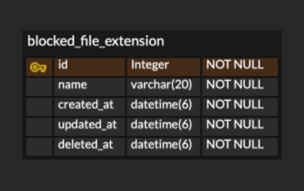
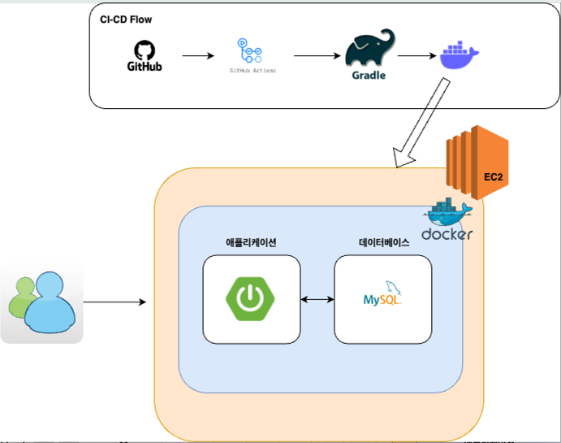

# Flow : Block-File-Extensions

### 과제 기간

2024/08/13 - 2024/08/17 23시까지

## 과제 고려사항

### 기술

- JAVA 17
- Spring Boot 3.x
- Spring Data JPA
- MySQL
- Thymeleaf
- Javascript
- AWS EC2
- Github action
- Docker

### 깃 전략

main → develop → feature

main : 상용 서버에 적용될 브랜치

develop : 개발 브랜치

feature : 각 기능을 구현할 브랜치

- feat/{name}-#{issue_number}

규칙

1. feature에서 develop으로 머지할 때는 squash 머지를 한다.
2. develop에서 main으로 머지할 때는 rebase 머지를 한다.

### 깃 컨벤션

- feat : 기능 구현
- refactor : 수정 사항
- test : 테스트 작성
- docs : 리드미 작성
- fix : 버그 수정
- chore : 세팅 업무

### ERD

### API 문서화
1. [GET] httpURL/blocked-file/extensions : 파일 확장자 뷰를 보여준다.
2. [POST] httpURL/blocked-file/{fixedExtensionId} : 고정된 확장자 상태를 변경시킨다.
3. [POST] httpURL/blocked-file/custom/extension : 커스텀 확장자를 추가한다.
     - RequestBody { "name" : }
4. [DELETE] httpURL/blocked-file/custom/extension : 커스텀 확장자를 삭제한다.
    - RequestBody { "name" : }

### 시스템 아키텍처

### 개발 고려사항

1. 고정 확장자 데이터 미리 데이터베이스에 삽입
    - 과제에서 주어진 고정 확장자를 일일이 삽입하는 수고를 덜기 위해 schema.sql로 테이블을 생성하고 
    data.sql에서 고정 확장자 데이터를 삽입하였습니다.
    - 따라서 애플리케이션 실행시 데이터베이스에 해당 데이터가 자동으로 저장됩니다.
    - 하지만 처음에는 데이터베이스에 없는 상태이므로 delete_at은 now(6)로 삽입하였습니다.

2. Thymeleaf를 사용하여 View를 구성
    - 과제에서 주어진 View는 하나이므로 Thymeleaf로 충분히 View를 구성할 수 있다고 판단하였습니다.
    - /blocked-file/extensions 엔드포인트에서 고정된 확장자 목록, 커스텀 확장자 목록, 커스텀 확장자의 개수를 조회하여 Model & View를 구성했습니다.
    - bootstrap을 사용하여 UI를 개선시켰습니다.

3. BaseEntity 상속
   - Entity를 구성할 때 create_at, update_at, deleted_at을 두어 운영하였을 때 데이터를 분석할 수 있는 가능성을 추가했습니다.
   - PK로는 Long 타입으로 비교적 적은 메모리와 저장공간을 사용하였습니다. 개발자가 데이터를 확인할 때 좀 더 식별하기 쉽습니다.

4. reentrantReadWriteLock의 쓰기 락 사용
   - 커스텀 확장자는 최대 200개 까지 저장 가능하고, 중복 불가능합니다. 멀티 쓰레드 환경에서 두 사용자가
     커스텀 확장자의 개수가 199개일 때 같이 조회하고 데이터를 삽입하면 데이터베이스에서 200개를 넘어서 저장이 되는 문제가 있습니다.
   - @Transactional은 AOP이기에 프록시 객체가 만들어지고, synchronized 키워드를 사용하여도 프록시 객체에서의 락이 걸리지 않아서
     해당 스레드의 트랜잭션이 커밋되기 전에 다른 스레드가 데이터를 읽을 수 있기 때문에 문제를 해결 할 수 없습니다.
   - 따라서 쓰기 락을 사용하여 하나의 스레드가 선점 시 다른 스레드는 대기할 수 있도록 구성했습니다. 

5. mock을 이용한 단위 테스트
   - Service 계층에서 repository를 모킹하여 단위 테스트를 진행하였습니다.

6. Github Action과 Docker을 이용한 CI-CD 구성
   - develop 브랜치에 Pull Request를 할 떄는 개발환경의 테스트를 자동화하여 안정성을 더 했습니다.
   - main 브랜치에 push할 때는 Build 확인 후 Docker를 사용하여 컨테이너 환경의 애플리케이션과 DB를 EC2에서 실행하도록 구성하였습니다.

7. AWS EC2 설정
   - 비용상 t2.micro를 사용하고 SWAP 메모리를 설정하였습니다.
   - .env 파일을 수동으로 넣어서 데이터베이스의 중요한 키 데이터를 관리 하였습니다.